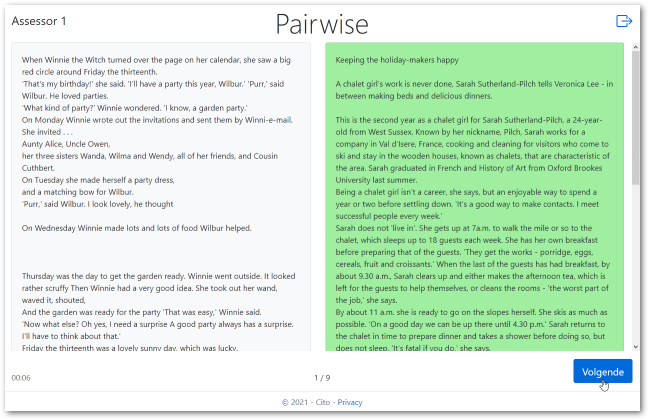
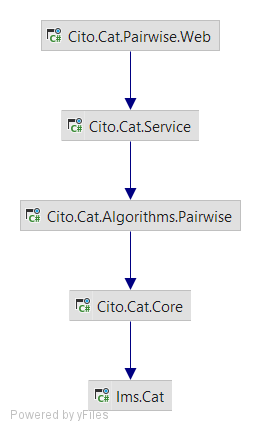

# Cito.Cat.Pairwise - Pairwise comparison of texts

## Introduction 
This ASP.NET Core (.NET5) web application enables pairwise comparisons of texts. 

Two texts are shown next to each other, and the user (an assessor) clicks the text that they consider 'best' according to criteria agreed upon beforehand.
Using all comparisons made in the session, the system uses MCMC sampling (Markov chain Monte Carlo) to estimate theta values for the texts. 
These estimates are then used to determine the next two texts to be shown to the assessor.

This application uses Cito's modular Computer Adaptive Testing (CAT) service framework which integrates with the upcoming 
first publication of the IMS CAT Standard (https://www.imsglobal.org/cat). The service framework will be separately published when
the standard goes into Public Final stage.

## Code structure

The diagram on the right shows the project dependency diagram of the application (excluding the unit test projects). External (NuGet) dependencies are omitted. 

#### Cito.Cat.Pairwise.Web
The ASP.NET5 web application. The frontend is implemented using Razor Pages.

#### Cito.Cat.Service
The main entry library to CAT-related apis, providing access to underlying selection algorithms.

#### Cito.Cat.Algorithms.Pairwise
The pairwise item selection algorithm. Uses Accord.NET (http://accord-framework.net/).

#### Cito.Cat.Core
Contains the interfaces, (domain) models and helper functions used in CAT algorithms.

#### Ims.Cat
Contains IMS CAT Standard proxy classes, generated using the specification files at https://www.imsglobal.org/cat and https://www.imsglobal.org/question/index.html#version2.1.

## Database
The application uses RavenDB (https://ravendb.net/) for persistence. Configure access to your instance in `appsettings.json`.

## Getting Started
1. Build the solution in the IDE of your preference (JetBrains Rider, VS2019, VSCode)
2. Configure your database      
3. Start the `Cito.Cat.Pairwise.Web` project, this also seeds 2 sample data sets. The start codes are 1234 and 0000
4. Profit.

## Build and Test
The solution should build without warnings. There are two unit test projects in the solution.